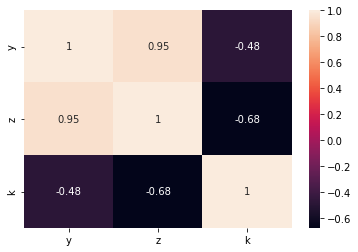
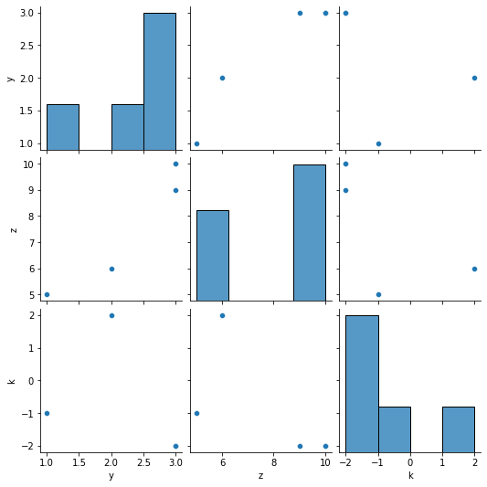
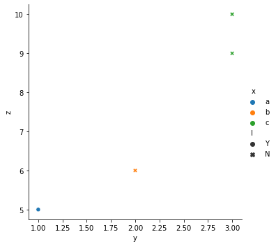
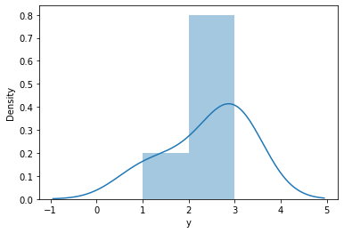
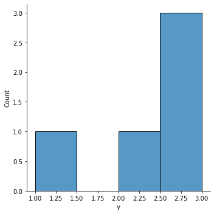
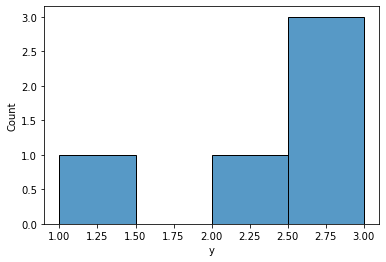
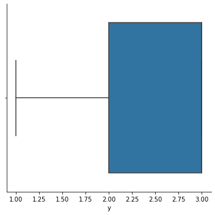

```python
import pandas as pd 
import numpy as np
import seaborn as sns
```


```python
data = pd.DataFrame([['a',1],['b',2],['c',3]], columns=['x','y'])
```

### 1. Understanding the data


```python
data.head()
```


<div>
<style scoped>
    .dataframe tbody tr th:only-of-type {
        vertical-align: middle;
    }

    .dataframe tbody tr th {
        vertical-align: top;
    }

    .dataframe thead th {
        text-align: right;
    }
</style>
<table border="1" class="dataframe">
  <thead>
    <tr style="text-align: right;">
      <th></th>
      <th>x</th>
      <th>y</th>
    </tr>
  </thead>
  <tbody>
    <tr>
      <th>0</th>
      <td>a</td>
      <td>1</td>
    </tr>
    <tr>
      <th>1</th>
      <td>b</td>
      <td>2</td>
    </tr>
    <tr>
      <th>2</th>
      <td>c</td>
      <td>3</td>
    </tr>
  </tbody>
</table>
</div>


```python
data.tail()
```


<div>
<style scoped>
    .dataframe tbody tr th:only-of-type {
        vertical-align: middle;
    }

    .dataframe tbody tr th {
        vertical-align: top;
    }

    .dataframe thead th {
        text-align: right;
    }
</style>
<table border="1" class="dataframe">
  <thead>
    <tr style="text-align: right;">
      <th></th>
      <th>x</th>
      <th>y</th>
    </tr>
  </thead>
  <tbody>
    <tr>
      <th>0</th>
      <td>a</td>
      <td>1</td>
    </tr>
    <tr>
      <th>1</th>
      <td>b</td>
      <td>2</td>
    </tr>
    <tr>
      <th>2</th>
      <td>c</td>
      <td>3</td>
    </tr>
  </tbody>
</table>
</div>


```python
data.shape
```


    (3, 2)


```python
data.describe() #numeric data only
```


<div>
<style scoped>
    .dataframe tbody tr th:only-of-type {
        vertical-align: middle;
    }

    .dataframe tbody tr th {
        vertical-align: top;
    }

    .dataframe thead th {
        text-align: right;
    }
</style>
<table border="1" class="dataframe">
  <thead>
    <tr style="text-align: right;">
      <th></th>
      <th>y</th>
    </tr>
  </thead>
  <tbody>
    <tr>
      <th>count</th>
      <td>3.0</td>
    </tr>
    <tr>
      <th>mean</th>
      <td>2.0</td>
    </tr>
    <tr>
      <th>std</th>
      <td>1.0</td>
    </tr>
    <tr>
      <th>min</th>
      <td>1.0</td>
    </tr>
    <tr>
      <th>25%</th>
      <td>1.5</td>
    </tr>
    <tr>
      <th>50%</th>
      <td>2.0</td>
    </tr>
    <tr>
      <th>75%</th>
      <td>2.5</td>
    </tr>
    <tr>
      <th>max</th>
      <td>3.0</td>
    </tr>
  </tbody>
</table>
</div>


```python
data.columns
```


    Index(['x', 'y'], dtype='object')


```python
data.nunique()
```


    x    3
    y    3
    dtype: int64


```python
data['x'].unique()
```


    array(['a', 'b', 'c'], dtype=object)


### 2. Cleaning the data


```python
data.isnull().sum()
```


    x    0
    y    0
    dtype: int64


```python
data = data.drop(['x'], axis=1)
```


```python
data.head()
```


<div>
<style scoped>
    .dataframe tbody tr th:only-of-type {
        vertical-align: middle;
    }

    .dataframe tbody tr th {
        vertical-align: top;
    }

    .dataframe thead th {
        text-align: right;
    }
</style>
<table border="1" class="dataframe">
  <thead>
    <tr style="text-align: right;">
      <th></th>
      <th>y</th>
    </tr>
  </thead>
  <tbody>
    <tr>
      <th>0</th>
      <td>1</td>
    </tr>
    <tr>
      <th>1</th>
      <td>2</td>
    </tr>
    <tr>
      <th>2</th>
      <td>3</td>
    </tr>
  </tbody>
</table>
</div>


### 3. Relationship analysis


```python
df = pd.DataFrame([['a',1,5,-1,'Y'],['b',2,6,2,'N'],['c',3,10,-2,'N'], ['c',3,10,-2,'N'],['c',3,9,-2,'N']], 
                   columns=['x','y','z','k','l'])
```


```python
correlation = df.corr()
```


```python
sns.heatmap(correlation, xticklabels=correlation.columns, yticklabels=correlation.columns, annot=True)
```


    <AxesSubplot:>


    

    


```python
sns.pairplot(df) #산점도와 히스토그램으로 시각화
```


    <seaborn.axisgrid.PairGrid at 0x7fc361b54dc0>


    

    


```python
sns.relplot(x='y', y='z', hue='x', data=df, style='l')
```


    <seaborn.axisgrid.FacetGrid at 0x7fc361b5f3a0>


    

    


```python
sns.distplot(df['y'])
```

    /Users/seomingyeong/.local/lib/python3.8/site-packages/seaborn/distributions.py:2619: FutureWarning: `distplot` is a deprecated function and will be removed in a future version. Please adapt your code to use either `displot` (a figure-level function with similar flexibility) or `histplot` (an axes-level function for histograms).
      warnings.warn(msg, FutureWarning)


    <AxesSubplot:xlabel='y', ylabel='Density'>


    

    


```python
sns.displot(df['y'])
```


    <seaborn.axisgrid.FacetGrid at 0x7fc358701fd0>


    

    


```python
sns.histplot(df['y'])
```


    <AxesSubplot:xlabel='y', ylabel='Count'>


    

    


```python
sns.catplot(x='y', kind= 'box', data= df)
```


    <seaborn.axisgrid.FacetGrid at 0x7fc378c06220>


    

    

